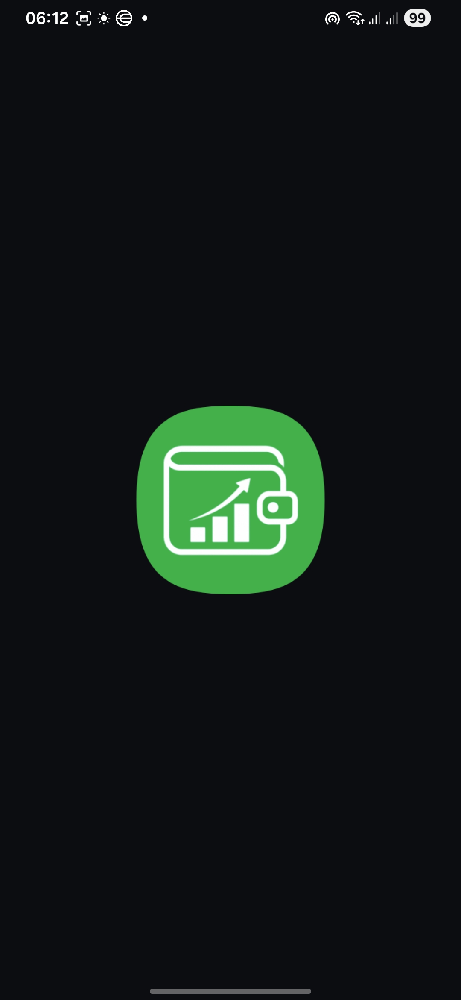
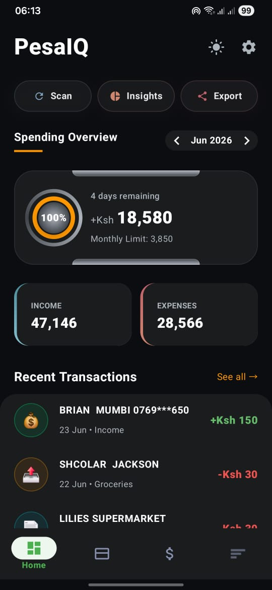
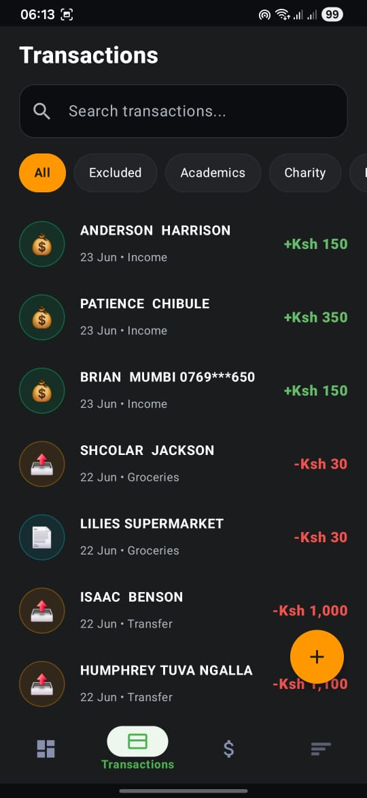
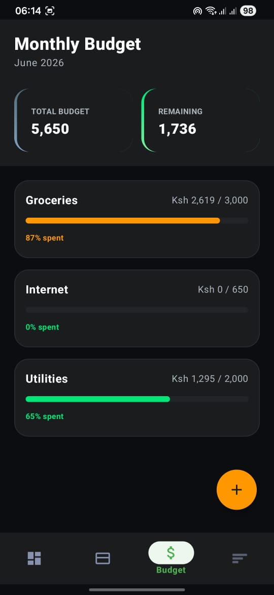
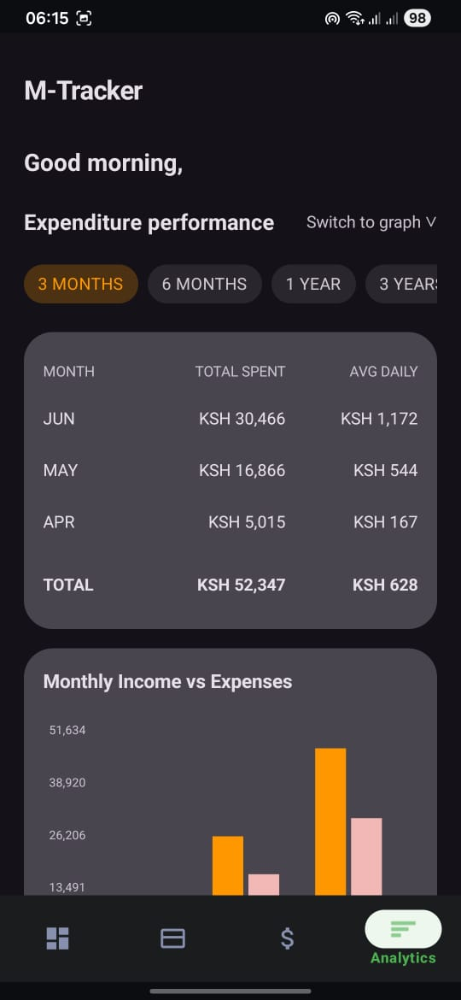
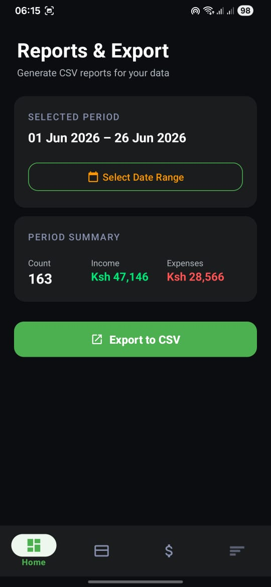
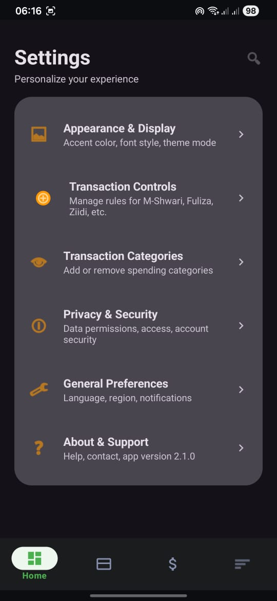
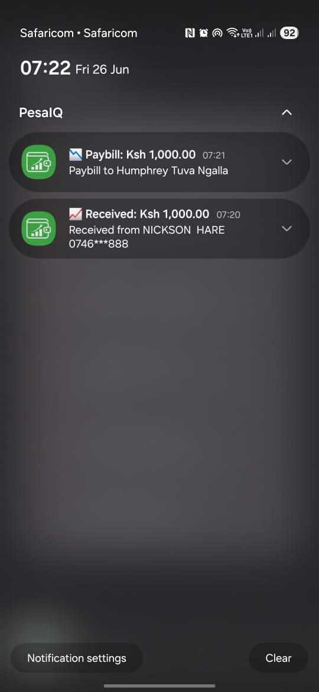
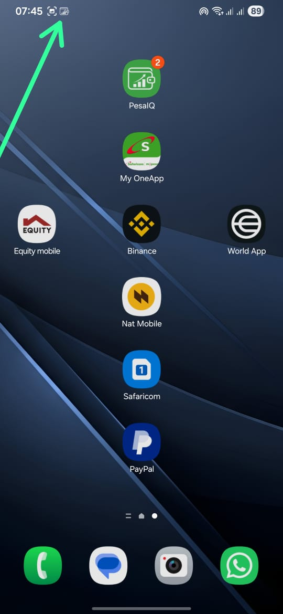

# PesaIQ

## Project Information
**Project:** PesaIQ
**Role:** Android Software Engineer
**Duration:** May 2026 – Present
**Status:** Version 1.0.0 Released
**Platform:** Android
**Language:** Kotlin

## Project Status
🟢 **Version 1.0.0 Released**

PesaIQ is available for download and currently supports automatic M-Pesa transaction tracking, budgeting, analytics, and CSV export.

Current development is focused on:
- Cloud synchronization
- AI-powered spending insights
- PDF statement import
- Multi-device support

## Overview
PesaIQ is an Android personal finance application that automatically tracks M-Pesa transactions by securely reading incoming SMS messages. It categorizes expenses, generates spending insights, manages budgets, and helps users understand their financial habits without requiring manual data entry.

## Inspiration
M-Pesa is the primary payment platform for millions of people across Kenya, yet many users still track their spending manually. PesaIQ was created to automatically convert M-Pesa transaction SMS messages into meaningful financial insights, helping users better understand and manage their finances.

## Responsibilities
- Designed the complete Android application architecture
- Developed the SMS parsing engine
- Implemented Room database storage
- Built the MVVM architecture
- Designed Material Design UI
- Developed budgeting and analytics features
- Implemented CSV export functionality
- Designed offline-first data synchronization strategy

## Problem
Managing M-Pesa expenses manually is time-consuming and often inaccurate. Most users rely on memory or manually enter transactions into budgeting apps, resulting in incomplete financial records.

## Solution
PesaIQ automatically detects M-Pesa SMS messages, extracts transaction details, categorizes spending, stores transactions locally, and provides dashboards, budgeting tools, and CSV exports to help users manage their finances.

## Key Features
- ✅ Automatic M-Pesa SMS detection
- ✅ Historical SMS import
- ✅ Intelligent transaction parsing
- ✅ Automatic expense categorization
- ✅ Budget management
- ✅ Spending analytics
- ✅ Interactive charts
- ✅ CSV export
- ✅ Offline-first storage
- ✅ Real-time notifications

## Architecture
```text
                 UI Layer
      (Activities / Fragments)
                 │
            ViewModels
                 │
        Repository Pattern
        ┌────────┴────────┐
        │                 │
  Room Database      SMS Processing
   (Local Data)   (Receiver + Parser)
```
> [!TIP]
> For a more detailed breakdown of the system design, check out the [Architecture Documentation](docs/architecture.md).

## Documentation
Additional technical details can be found in the `docs/` folder:
- [Architecture Design](docs/architecture.md) - High-level system overview.
- [SMS Parser Engine](docs/parser.md) - Detailed explanation of regex and categorization logic.
- [Project Roadmap](docs/roadmap.md) - Planned features and future improvements.

## Tech Stack
### Language
- Kotlin

### Architecture
- MVVM
- Repository Pattern

### Libraries
- Room
- Coroutines
- Flow
- Navigation Component
- MPAndroidChart
- Material Design 3
- WorkManager

### Storage
- Room (SQLite)

## Screenshots

### Splash Screen


### Dashboard


### Transactions


### Budgets


### Analytics


### Export & Settings



### Notification




## Project Structure
```text
pesaiq/
├── app/
│   ├── src/
│   │   ├── main/
│   │   │   ├── java/com/mpesa/tracker/
│   │   │   │   ├── data/          # Room DB, Repository, DAOs, Entities
│   │   │   │   ├── sms/           # SMS Receiver & Parsing Logic
│   │   │   │   ├── ui/            # ViewModels, Fragments, Adapters
│   │   │   │   └── utils/         # Helper classes & Extensions
│   │   │   └── res/               # Layouts, Drawables, Values (M3)
└── screenshots/                   # Project screenshots
```

## Download

### Direct Download
You can download the latest version of the app directly from the releases page:
- 📥 **[Download PesaIQ APK v1.0.0](https://github.com/HumphreyTuva/PesaIQ/releases/download/v1.0.0/PesaIQ.apk)**

### Requirements
- Android 8.0 (API 26) or newer
- SMS permission
- Notification permission

## Build from Source
1. Clone this repository:
   ```bash
   git clone https://github.com/HumphreyTuva/PesaIQ.git
   ```
2. Open the project in **Android Studio (Ladybug or newer)**.
3. Wait for the Gradle sync to complete.
4. Run the application on a physical device or emulator (API 24+ recommended).
5. Grant **SMS Permissions** when prompted to allow automatic transaction tracking.

## Privacy & Security
PesaIQ is designed with privacy as a core principle.

- SMS messages are processed entirely on-device.
- No SMS content is transmitted to external servers.
- Financial data is stored locally using Room (SQLite).
- Internet access is not required for core functionality.
- Users retain full control over their financial data.

## Challenges Solved
- Parsing multiple M-Pesa SMS formats reliably.
- Processing SMS broadcasts without blocking the UI.
- Maintaining data consistency during historical imports.
- Designing an offline-first personal finance application.

## Lessons Learned
- Android permissions require careful UX design.
- SMS parsing benefits from modular parser design.
- MVVM simplifies long-term maintenance.
- Offline-first applications provide a more reliable user experience.

## Releases

### Version 1.0.0
- Automatic M-Pesa SMS detection
- Historical SMS import
- Budget management
- Spending analytics
- Interactive charts
- CSV export
- Real-time transaction notifications

## Future Improvements
- Django backend synchronization
- Cloud backup
- Google Sheets integration
- PDF statement import
- Dark mode
- AI spending insights
- Multi-device synchronization

## Disclaimer
PesaIQ is an independent personal finance application and is not affiliated with, endorsed by, or sponsored by Safaricom PLC or M-Pesa.

## License
Distributed under the MIT License. See `LICENSE` for more information.
